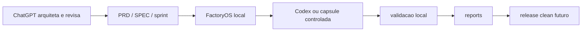

# FactoryOS

FactoryOS é uma fábrica local-first para transformar ideias, PRDs e specs em MVPs, automações, sites e sistemas com execução controlada, validação e reports.

## Para quem é

- Pessoas que querem criar ou retomar projetos sem entregar segredos para serviços externos.
- Desenvolvedores que querem um fluxo local com tarefas, cápsulas, worktrees, validação e auditoria.
- Contribuidores que querem evoluir o FactoryOS como framework/ferramenta publicável.

## O que ele faz

- Recebe intenção, PRD, SPEC, sprints e artefatos.
- Decide quando usar Python local, Ollama/local LLM, Codex controlado ou revisão humana.
- Cria tasks, runs, cápsulas, reports e planos de aplicação.
- Mantém bloqueios padrão: sem push, sem deploy, sem API paga e sem secrets.
- Expõe um painel local read-only com Ajuda navegável.

## Fluxo resumido



## Instalação local

```bash
python3 -m venv .venv
. .venv/bin/activate
pip install -r requirements.txt
```

## Rodar o painel

```bash
.venv/bin/python -m app.web
```

Abra `http://127.0.0.1:8787`. A aba Ajuda fica em `http://127.0.0.1:8787/help`.

## Comandos principais

Use sempre o formato local:

```bash
.venv/bin/python -m app.cli <comando> [opcoes]
```

Exemplos úteis:

- `route`: classifica uma tarefa.
- `task-create`, `task-list`, `task-start`, `task-finish`: controlam tasks.
- `run-create`, `run-workspace-prepare`, `run-workspace-status`: controlam runs.
- `codex-capsule-create`, `codex-capsule-run`, `codex-capsule-diff`: operam cápsulas.
- `factory-start`, `factory-queue-start`: iniciam execução controlada.
- `reversa-global-check`, `reversa-project-plan`, `reversa-project-status`: retomam projeto antigo com Reversa.
- `help-docs-list`, `help-docs-check --dry-run`: validam a Ajuda local.
- `public-export-leak-review --dry-run`: revisa achados redigidos antes de release público.

Veja a referência completa em [docs/COMMANDS.md](docs/COMMANDS.md).

## Segurança

FactoryOS é local-first. Por padrão, push, deploy, API paga e secrets são bloqueados. O frontend e o painel não recebem segredo nem regra crítica. Tarefas com autenticação, autorização, pagamento, dados sensíveis, banco, deploy ou segurança crítica exigem revisão humana antes da execução.

## Reversa

Reversa ajuda a retomar projetos antigos: lê estrutura e artefatos locais, planeja intake e guarda limites de alvo. No V0, o FactoryOS ensaia e valida; instalação live e mudanças automáticas em projeto alvo ficam bloqueadas por padrão.

## Status da V1

A V1 está em technical freeze operacional: painel local, política de 2h, cápsulas, integração Reversa, higiene, cleanup e gates de readiness já existem como base local. Release público ainda deve passar por estratégia clean.

## Docs completas

Comece por [docs/README.md](docs/README.md). Principais páginas:

- [Primeiros passos](docs/GETTING_STARTED.md)
- [Guia de uso](docs/USER_GUIDE.md)
- [Arquitetura](docs/ARCHITECTURE.md)
- [Comandos](docs/COMMANDS.md)
- [Segurança](docs/SECURITY.md)
- [Reversa](docs/REVERSA.md)
- [Contribuição](docs/CONTRIBUTING.md)

## Contribuição

Leia [docs/CONTRIBUTING.md](docs/CONTRIBUTING.md). Mudanças devem ser pequenas, validáveis, sem segredos e com reports quando alterarem fluxo operacional.

## Licença

License: TBD.
