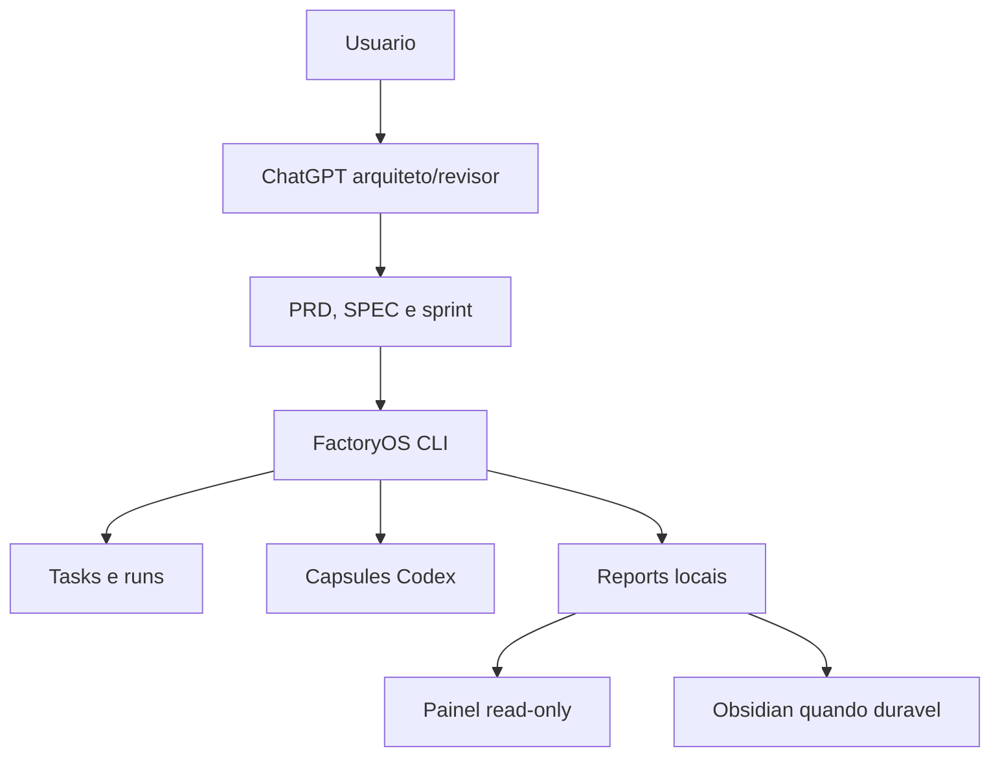
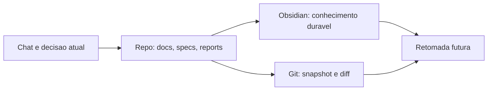
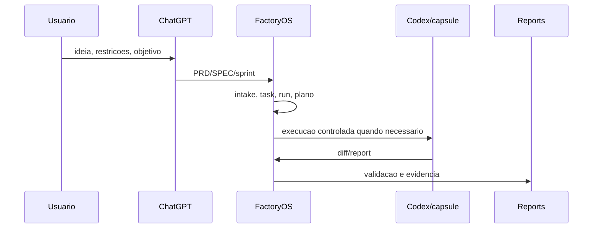
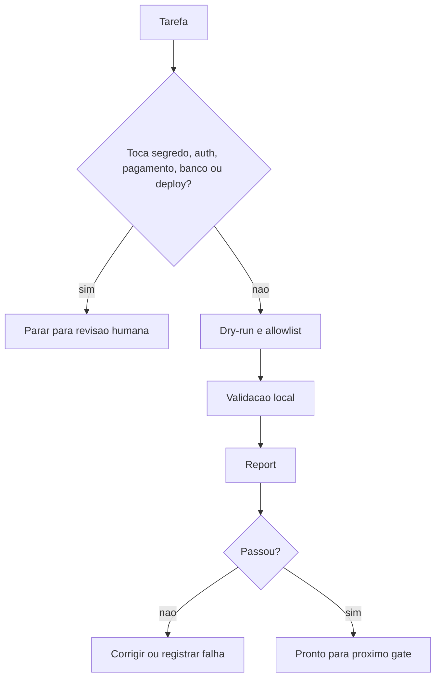
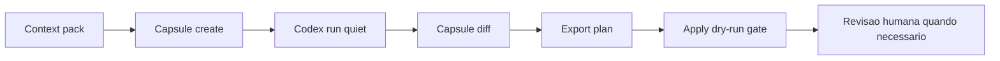
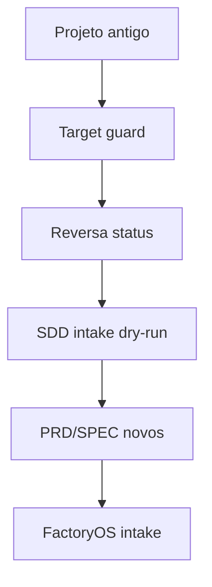

# Arquitetura

FactoryOS separa backend, painel local, CLI, memória, runner e reports. O painel é read-only; regras críticas ficam no backend e nos comandos locais.

## Visão geral

## Backend e frontend separados

- Backend: `app/*.py`, CLI, validações, leitura segura de arquivos e reports.
- Frontend local: `app/templates/` e `app/static/style.css`.
- Painel: FastAPI em `app/web.py`, sem segredo e sem mutação crítica.

## Módulos principais

- `app/cli.py`: registra comandos reais.
- `app/web.py`: painel local e viewer read-only.
- `app/help_center.py`: allowlist de docs e renderização Markdown segura.
- `app/task_runner.py`: tasks locais.
- `app/run_workspace.py`: runs e worktrees.
- `app/codex_context_capsule.py`: criação e inspeção de cápsulas.
- `app/codex_capsule_execution.py`: execução, diff e export plan de cápsulas.
- `app/reversa_integration.py`: guards e reports para Reversa.
- `app/report_index.py`: listagem e leitura de reports.

## Memória em camadas

## Fluxo de projeto

## Fluxo de segurança

## Ciclo Codex/capsule

## Reversa intake

