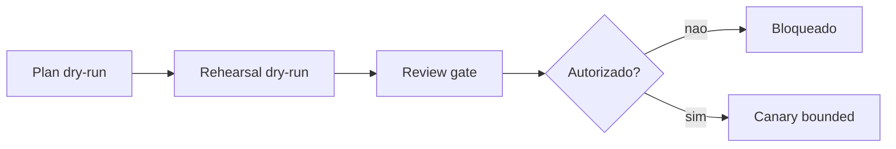

# Runs estendidas

Runs estendidas existem para permitir trabalho mais longo sem virar execução livre.

## Política de 2h

O limite de 2h é um teto controlado, não autorização para rodar qualquer coisa. A execução continua task-by-task, com gates, budgets e stop conditions.

## Por que não é execução livre

FactoryOS deve saber o objetivo, os caminhos permitidos, o orçamento, os passos e quando parar. Sem isso, a run longa é bloqueada ou fica em rehearsal.

## Task-by-task

Cada tarefa precisa ter escopo pequeno, validação local e report. O próximo passo só avança se o gate anterior permitir.

## Cápsula primeiro

Docs e mudanças pequenas devem preferir cápsula. Repo-wide live só entra quando capsule/worktree não resolver e houver justificativa.

## Budget caps

Use caps de minutos, steps, arquivos alterados, contexto e output. Comandos como `extended-cheap-run-plan`, `extended-cheap-run-rehearsal` e `extended-cheap-run-gate` mantêm a política explícita.

## Stop conditions

Pare quando houver:

- falha de validação;
- segredo detectado;
- path fora da allowlist;
- custo acima do budget;
- mudança maior que o plano;
- necessidade de revisão humana;
- tentativa de push, deploy ou API paga.

## Gates

