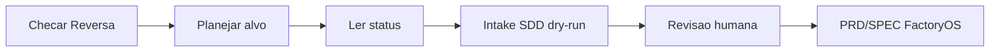

# Reversa

Reversa é a camada de retomada de projetos antigos. Ela ajuda a entender um projeto existente antes de transformar isso em PRD, SPEC, sprint e execução FactoryOS.

## O que é

É um fluxo de leitura e planejamento para projetos legados. Ele verifica disponibilidade local, alvo, estado e artefatos gerados por Reversa.

## Para que usar

- Retomar projeto parado.
- Entender estrutura antes de mexer.
- Criar intake SDD para virar PRD/SPEC.
- Evitar aplicar mudanças em diretório errado.

## Instalação global já suportada

FactoryOS consegue verificar `node`, `npm`, `reversa` e `npx --no-install reversa` sem instalar nada:

```bash
.venv/bin/python -m app.cli reversa-global-check
```

## Comandos FactoryOS

- `reversa-global-check`: checa ferramentas disponíveis.
- `reversa-project-plan --target <path> --dry-run`: planeja instalação.
- `reversa-project-install --target <path> --dry-run`: ensaia instalação; live bloqueado no V0.
- `reversa-project-status --target <path>`: lê estado local.
- `reversa-project-sdd-intake --target <path> --dry-run`: classifica `_reversa_sdd/`.

## Target guards

Guards impedem alvo protegido, symlink perigoso, caminho ausente e sujeira Git fora dos artefatos Reversa permitidos. Os caminhos protegidos incluem `factoryos` e `harness`.

## Fluxo para projeto antigo



## O que pode ser lido

- `.reversa/state.json`, se existir.
- `_reversa_sdd/`, se existir.
- Estado Git do projeto alvo.
- Estrutura mínima necessária para o report.

## O que não pode ser automático

- Instalar live sem autorização.
- Fazer push.
- Fazer deploy.
- Ler ou mover secrets.
- Alterar projeto de outra pessoa sem relatório e aprovação.
