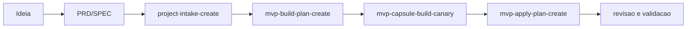
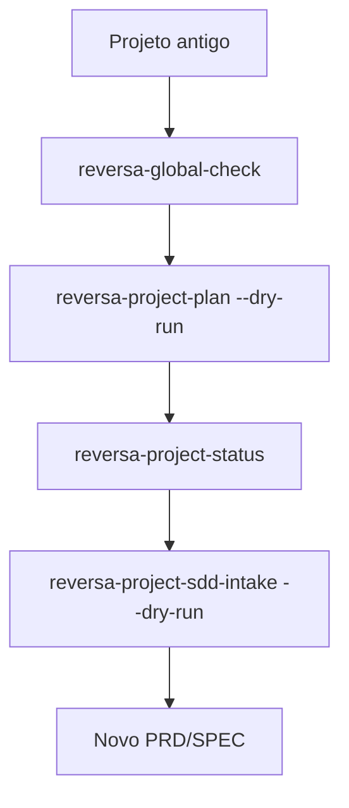
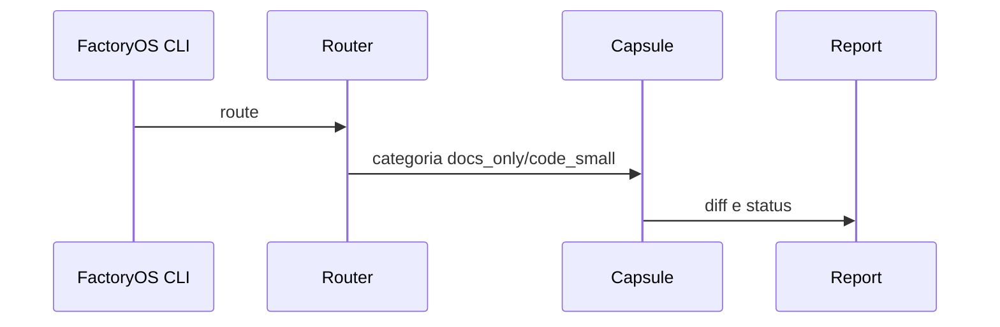
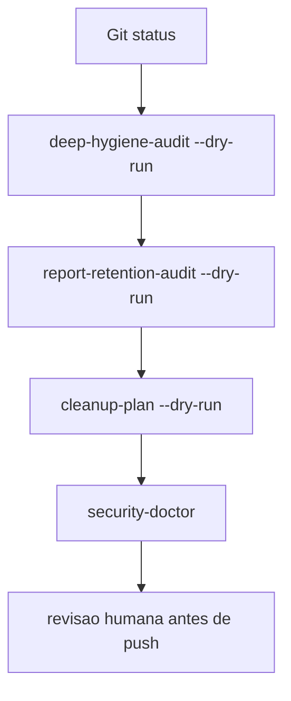

# Fluxos operacionais

Esta página mostra receitas seguras. Cada fluxo separa o que é, para que serve, como usar e como validar.

## 1. Criar MVP novo

O que é: transformar uma ideia em intake, plano e execução controlada.

Para que serve: reduzir improviso antes de Codex ou cápsula.



Como usar:

```bash
.venv/bin/python -m app.cli project-intake-create --help
.venv/bin/python -m app.cli mvp-build-plan-create --help
.venv/bin/python -m app.cli mvp-capsule-build-canary --help
```

Como validar: leia o report criado, rode checks do projeto alvo e mantenha aplicação live bloqueada até revisão.

## 2. Retomar projeto antigo com Reversa

O que é: ler o projeto antigo antes de mudar qualquer estrutura.

Para que serve: recuperar contexto, dependências e intenção de um projeto parado.



Como usar:

```bash
.venv/bin/python -m app.cli reversa-global-check
.venv/bin/python -m app.cli reversa-project-plan --target <CODE_ROOT>/projeto --dry-run
.venv/bin/python -m app.cli reversa-project-sdd-intake --target <CODE_ROOT>/projeto --dry-run
```

Como validar: confirme que o alvo não é `factoryos` nem `harness`, que o Git do alvo não tem sujeira perigosa e que o report é dry-run.

## 3. Rodar tarefa barata

O que é: executar mudança pequena com contexto mínimo e custo controlado.

Para que serve: evitar chamar Codex pesado para microtarefa.



Como usar:

```bash
.venv/bin/python -m app.cli route "atualizar FAQ"
.venv/bin/python -m app.cli cheap-task-factory-e2e --category docs_only --label faq --dry-run
```

Como validar: veja `capsule-run-status`, `codex-capsule-diff` e `help-docs-check --dry-run` quando tocar docs.

## 4. Revisar reports

O que é: usar reports como fonte de verdade local.

Para que serve: saber o que aconteceu sem depender do chat.

Como usar:

```bash
.venv/bin/python -m app.cli report-list factory-start --limit 5
.venv/bin/python -m app.cli report-latest factory-start
.venv/bin/python -m app.cli execution-evaluate --report reports/<arquivo>.json
```

Como validar: report deve ter `ok`, caminho, decisão, entradas e próximos passos.

## 5. Preparar release clean

O que é: deixar o repositório publicável sem levar reports privados, worktrees, caches ou segredos.

Para que serve: publicar no GitHub com confiança.



Como usar:

```bash
git status --short --branch
.venv/bin/python -m app.cli deep-hygiene-audit --dry-run
.venv/bin/python -m app.cli report-retention-audit --dry-run
```

Como validar: `git diff --check`, `help-docs-check --dry-run`, doctors do harness e revisão manual de secrets antes de qualquer push.
