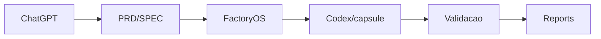
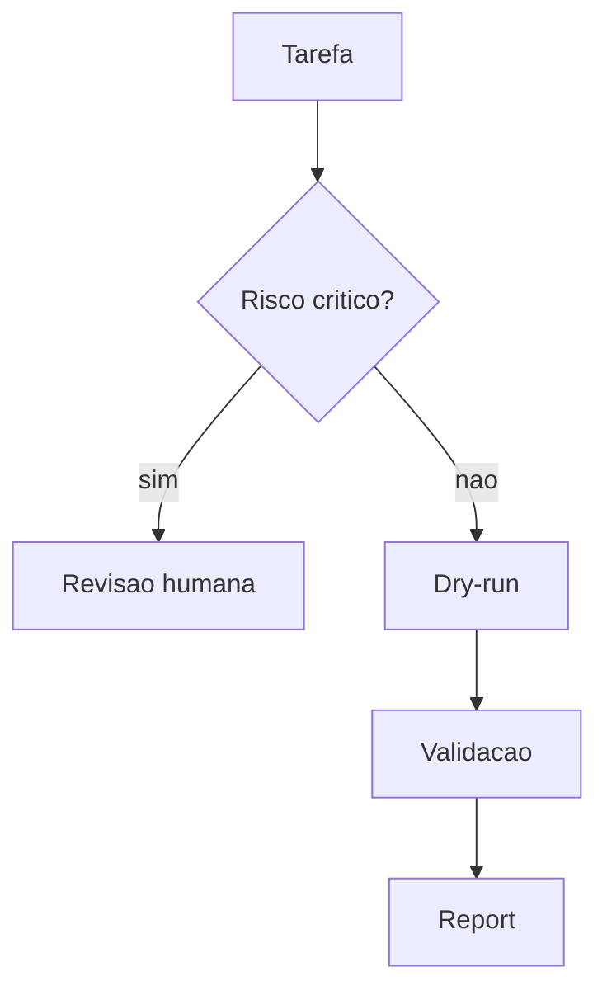
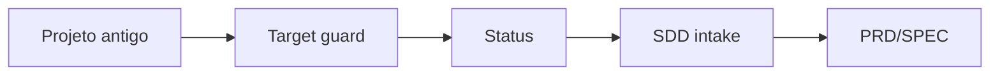

# Diagramas

Esta página indexa os diagramas Mermaid principais. No painel local, eles aparecem como código legível e seguro.

## Fluxo macro

```mermaid
flowchart LR
  A[ChatGPT] --> B[PRD/SPEC]
  B --> C[FactoryOS]
  C --> D[Codex/capsule]
  D --> E[Validacao]
  E --> F[Reports]
```

## Segurança

```mermaid
flowchart TD
  A[Tarefa] --> B{Risco critico?}
  B -- sim --> C[Revisao humana]
  B -- nao --> D[Dry-run]
  D --> E[Validacao]
  E --> F[Report]
```

## Reversa

```mermaid
flowchart LR
  A[Projeto antigo] --> B[Target guard]
  B --> C[Status]
  C --> D[SDD intake]
  D --> E[PRD/SPEC]
```
